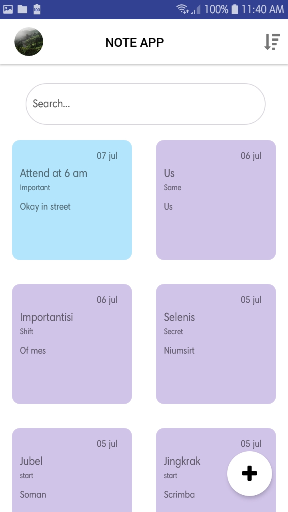
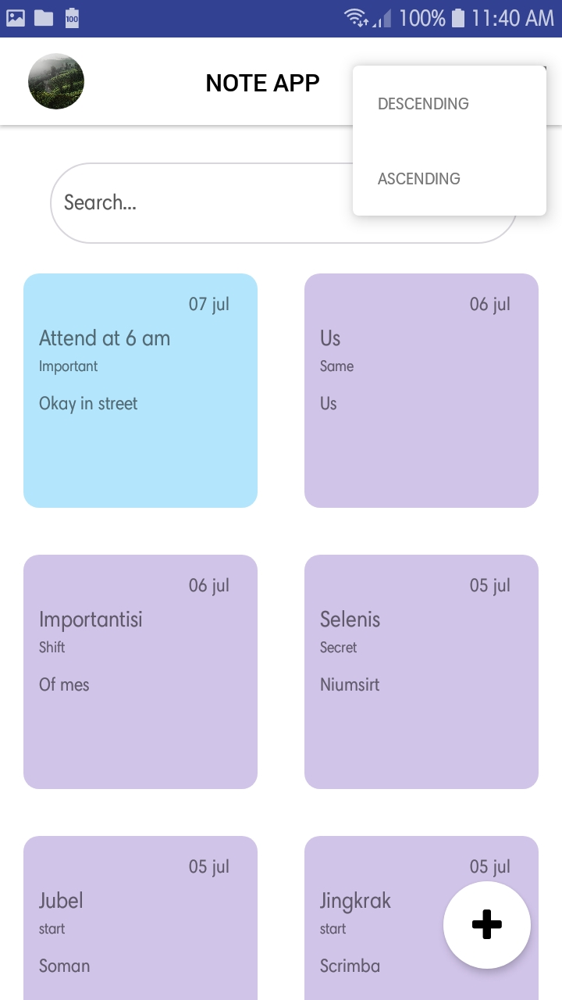
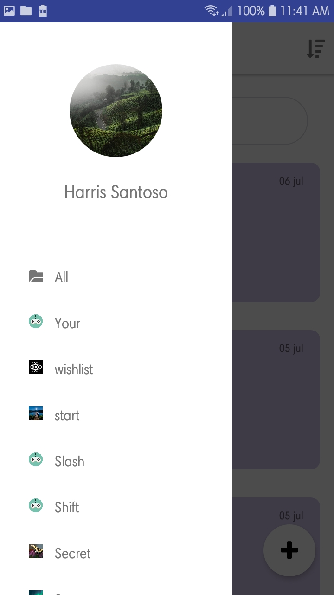
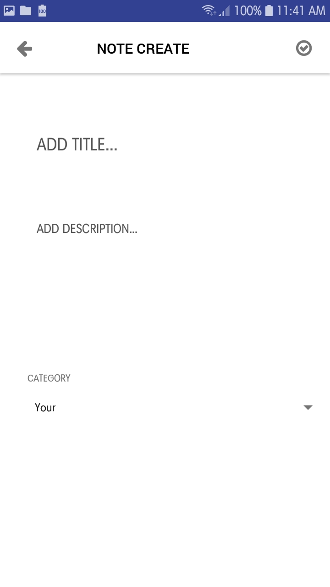
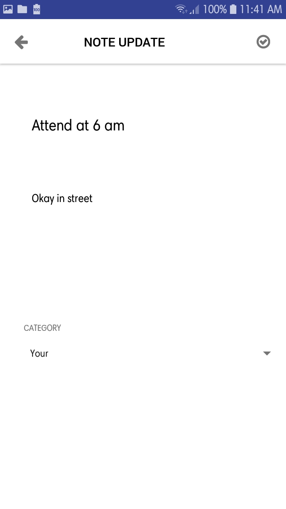

<h1 align=center>Simple Note App</h1>
<h3 align=center> an part of frontend simple_note_server </h3>

<p align='center'>
  
</p>

<div align=center>Icons made by <a href="https://www.flaticon.com/authors/fadyucf" title="FadyUCF">FadyUCF</a> from <a href="https://www.flaticon.com/"                 title="Flaticon">www.flaticon.com</a> is licensed by <a href="http://creativecommons.org/licenses/by/3.0/"                 title="Creative Commons BY 3.0" target="_blank">CC 3.0 BY</a></div>

<br>
<br>

- # Preview of application
  ### click image below to play an video

[](http://www.youtube.com/watch?v=Fgz6cXm1llo "Apps Preview, click here to play the video")

- ## Run Apps via development mode
  
  - Requirements

    click the name to download or read guides installation

    1. [Node.js](https://nodejs.org/en/download/ "link to download the node.js")
    2. [react-native-cli](https://facebook.github.io/react-native/docs/getting-started "link to guide installing react-native-cli") 
    3. [Backend server](https://github.com/hrs234/simple_note_server.git "link to download the backend server") 


  - installation 
    
    - firstly clone this git and place into your workspace folder


    - and run cd command via bash or cmd windows
    
    ```
        cd [YOUR_DIRECTORY_WORKSPACE]
    ```

    - after that type this command
  
    ```
        //for Android

        react-native run-android

        //for IOS

        react-native run-ios
    ```


 - ## Installing Apps via APK
        
    - download [simpleNotes.apk](https://drive.google.com/open?id=1Fqo2V_PzLaD4KivEy65HD7WVG2sKP15X "click here to download APK file installation")
  
    - copy that apk to your devices

    - after that touch the apk file in where your store the apk file

    - and install it


 - # Screenshoot Application

 - ## Main Pages

     

 - ## Ascending descending selection

    

 - ## Drawer for listing category and adding category

    


 - ## adding new notes page

    

 - ## update notes page

    


